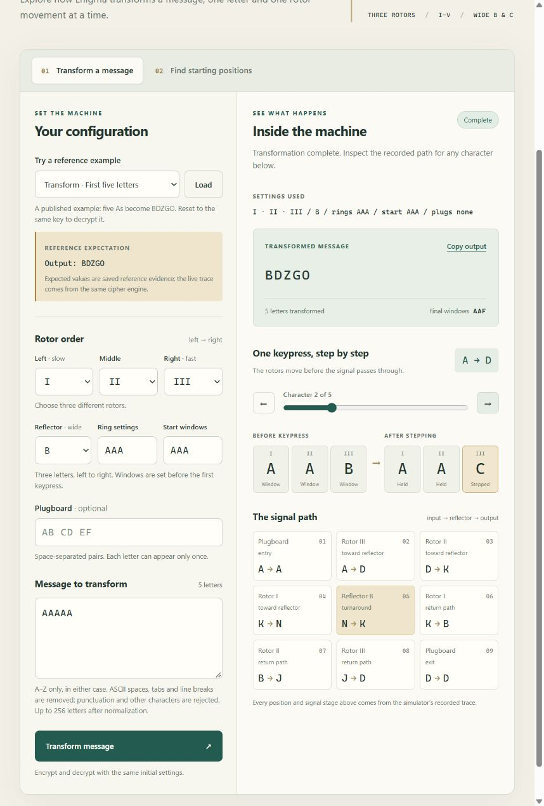
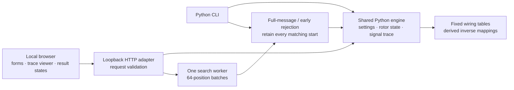
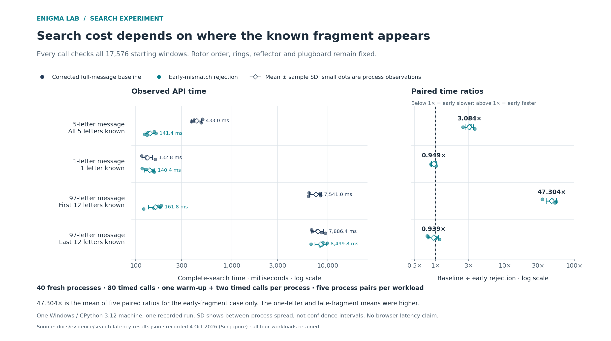

# Enigma Lab

I began this project because I wanted to understand Enigma and explore what a
modern computer could do with a problem that fascinated me through Alan Turing's
work. My original Python prototype was unfinished. Revisiting it turned that
curiosity into a tested simulator, a local browser workbench and a measured study
of two ways to search for starting positions.

The workbench makes the machine's state visible: follow a letter through the
plugboard and rotors, see the double step, then explore why a known fragment
can leave one answer, many answers or none.

[Run locally](#run-locally) · [How it works](#one-engine-two-interfaces) ·
[Search experiment](#measured-search-tradeoffs) · [Tests](TESTING.txt) ·
[Project history](docs/project-history.md)



## Run locally

With Python 3.12+ installed, open a terminal in the repository root:

```sh
python -B -X utf8 -m enigma_demo
```

Open the printed `http://127.0.0.1:<port>/` address and keep the terminal running.
The application needs **no third-party runtime packages**, remote services or
frontend build step. Python 3.12.14 on Windows is the recorded local environment.
The [demo guide](DEMO.txt) covers the optional PowerShell launcher, controls and
troubleshooting.

Try the saved examples:

| Example | What to look for |
|---|---|
| First five letters | `AAAAA → BDZGO`, ending at windows `AAF`; inspect each letter's signal path |
| See the double step | `AAA → DKR`; windows move `ADU → ADV → AEW → BFX` |
| Rings and plugboard | `BLA → KCH` with the supplied nondefault settings |
| Recover the starting windows | A complete 17,576-position search returns `AAA` |
| One letter, many answers | All 714 matching starts are retained instead of pretending the key is unique |

The reference expectations are stored separately from the computed results.
Other examples explore an early fragment, a late fragment and a complete search
with no matches. Editing a form marks an existing result as belonging to its
previous inputs. Cancellation and a lost server connection have distinct states;
partial matches are not presented as a completed search.

The same engine is available from the command line:

```sh
python -B -X utf8 -m enigma_lab transform --text AAAAA
python -B -X utf8 -m enigma_lab transform --text AAAAA --trace
python -B -X utf8 -m enigma_lab search --ciphertext BDZGO --crib AAAAA
```

The CLI search uses the full-message baseline. Early rejection is available
through the browser and the Python API.

## A specific search question

Given the **rotor order, rings, reflector, plugboard and aligned known plaintext**,
which starting windows agree with the ciphertext? The search checks every one of
**26³ = 17,576** starting triples and returns all matches. This is the bounded
search domain, not the complete Enigma keyspace or the machine's stepping period.

The supported model uses three distinct rotors selected from **I–V**, wide
reflector **B or C**, three-letter rings and windows, and up to thirteen disjoint
plugboard pairs. Rotor order is left to right, slow to fast. It is a documented
three-rotor subset, not a claim of full M3/M4 support or arbitrary key recovery.

## One engine, two interfaces



The browser renders trace records from Python; it contains no second cipher
implementation. Each transformation owns a fresh machine. The CLI and browser
therefore share the same stepping and signal behaviour, while keeping interface
validation and job lifecycle separate.

| Layer | Responsibility | Source |
|---|---|---|
| Machine | Immutable settings, moving rotor state, transformation and trace | [engine.py](enigma_lab/engine.py), [specs.py](enigma_lab/specs.py) |
| Search | Complete candidate enumeration and optional early rejection | [search.py](enigma_lab/search.py), [search_early.py](enigma_lab/search_early.py) |
| Interfaces | CLI parsing and validated local requests | [cli.py](enigma_lab/cli.py), [service.py](enigma_demo/service.py) |
| Local service | Fixed asset routes, request guards and job control | [server.py](enigma_demo/server.py), [jobs.py](enigma_demo/jobs.py) |
| Browser | Examples, forms, trace viewer and result states | [static assets](enigma_demo/static), [samples](enigma_demo/samples.json) |

## Engineering decisions

| Decision | Reason | Tradeoff |
|---|---|---|
| Separate immutable settings from mutable positions | Reset and continuation are explicit; one request cannot consume another's rotor sequence | Individual machine instances are still not thread-safe |
| Derive reverse wiring from the forward permutation | One coordinate convention handles ring/position offsets in both directions | Internal consistency still needs independent reference cases |
| Decide stepping before moving any rotor | Middle/right notch conditions use one shared pre-key state, preserving double stepping | More subtle than incrementing a counter after a transformation |
| Validate the whole message before mutation | An invalid final character cannot leave the machine partly advanced | A full validation pass is required, even when early search will skip a suffix |
| Keep two search implementations | The full-message baseline remains a clear comparator; early rejection can stop work within each candidate | Which implementation is faster depends on the workload |
| Batch browser searches | Progress, cancellation and deadlines can be checked between batches | Repeated setup adds overhead; this is one thread, not multicore acceleration |

The original prototype could undo its own output while still using an incorrect
coordinate mapping. That made independent expected outputs essential: round-trip
success alone does not establish that a simulator matches the intended machine.
The [design notes](DESIGN_NOTES.txt) explain the repair, stepping rule, state
ownership and search invariants.

## Measured search tradeoffs

The frozen experiment compared the **corrected full-message search** with early
crib-mismatch rejection. It used 40 fresh worker processes and 80 timed calls
across four fixed workloads. Each worker warmed up once, then timed two complete
17,576-position API calls. Each row summarizes five process means.



| Workload | Baseline, mean ± SD ms | Early rejection, mean ± SD ms | Matching starts |
|---|---:|---:|---:|
| Five letters, full crib | 432.994 ± 50.901 | 141.441 ± 16.690 | 1 |
| One-letter ambiguous crib | 132.752 ± 16.382 | 140.355 ± 17.227 | 714 |
| 97 letters, first 12 known | 7,541.028 ± 1,092.585 | 161.816 ± 25.860 | 2 |
| Same 97 letters, last 12 known | 7,886.375 ± 1,157.025 | 8,499.795 ± 1,161.903 | 2 |

For the **early-fragment workload**, the mean paired baseline/early ratio was
**47.304×**, with sample SD 7.865 across five pairs. This is the mean of the
paired ratios, not the ratio of the grand means. Early rejection was faster in
all five pairs for this case and the five-letter case. Its observed mean was
higher for the one-letter and late-fragment cases; the late case had mixed
pair directions. Every case and observation is retained.

Early rejection saves work when a candidate disagrees near the beginning. A
late fragment still requires advancing through its prefix; a one-letter message
offers no reduction in letter transformations. Per-character validation overhead
is a plausible contributor to the slower cases, but was not isolated by profiling.

Both 97-letter cases return `UEW` and `VFW`. Under their fixed settings, those
starts both step to `VFX` before the first signal, so a longer crib cannot
separate them. Returning two matches is the correct expression of that ambiguity.

These are **API-call measurements on one Windows machine**, using Python 3.12.14
and four wide-B workloads. The browser uses batched calls with different overhead.
The results do not establish browser latency, a universal speedup or an advantage
over wartime hardware. The comparator is not the unfinished original prototype.
See the [full measurement record](experiments/search-latency-v1/MEASURED_RESULTS.txt),
[portable observations](docs/evidence/search-latency-results.json) and
[frozen protocol](experiments/search-latency-v1/EXPERIMENT.txt).

## Tests and verification

A fresh local run passed **151 unittest methods**. Coverage across all twelve
Python modules in `enigma_lab` and `enigma_demo` was **96.46% combined**:
705/725 statements (97.24%) and 222/236 branch opportunities (94.07%). Formatting
and lint checks passed. The [dated verification record](docs/evidence/integration-verification.json)
keeps the local tests and browser observations separate. Tests combine:

- Published examples, saved double-step traces and a 34-case reference corpus
  generated with the independent Py-Enigma 1.0.2 implementation.
- A complete independently enumerated 17,576-candidate reference for the basic
  search, plus full-domain differential checks for the other workloads.
- State/validation regressions, real loopback HTTP requests, malformed payloads,
  request guards, job cancellation and complete search results.

Expected outputs are saved rather than regenerated with the code under test.
Py-Enigma is reference tooling, not a runtime dependency. Narrow injected failures
and clocks exercise exceptional paths without replacing cipher correctness tests.

The [CI workflow](.github/workflows/ci.yml) runs formatting, lint, tests and the
90% combined coverage floor on Windows and Ubuntu with Python 3.12. Hosted results
must be checked for the relevant commit; local coverage does not measure browser
JavaScript, PowerShell or historical fidelity. See [TESTING.txt](TESTING.txt) for
commands, recorded evidence and the remaining gaps.

## Boundaries and next steps

The local server binds to `127.0.0.1`, loads fixed local assets and keeps inputs
and jobs in memory. Host/Origin checks and a per-launch token constrain local
requests; they are not a public-service authentication design. The browser accepts
up to 256 normalized letters per field. Its 60-second deadline is cooperative
between batches, so an executing batch may finish afterward.

Reference-software agreement covers the declared configurations, not every key
or a physical machine. Other Enigma variants, real user-console interruption
behaviour and a full browser/accessibility matrix need separate verification.
This is a historical-computing experiment, not a modern encryption tool.

Useful next work would profile the short and late search cases, expand independent
fixtures, and automate browser checks for stale results and connection loss.
A broader key search would need a newly defined domain and correctness reference.

## History and references

The [project history](docs/project-history.md) separates the unfinished original
from the tested revision. The original creation date and successful recovery of
any historical message are not established. Codex assisted the recent engineering,
tests and documentation; the initial curiosity and early prototype were mine.

[Crypto Museum's operating explanation](https://www.cryptomuseum.com/crypto/enigma/working.htm)
and [wiring tables](https://www.cryptomuseum.com/crypto/enigma/wiring.htm) describe
stepping and fixed data. The [Py-Enigma guide](https://py-enigma.readthedocs.io/en/latest/guide.html)
provides the nondefault `BLA → KCH` example. [Fixture provenance and notices](tests/fixtures/README.txt)
identify external reference material. Those third-party notices apply to their
source material, not to the entire application.
